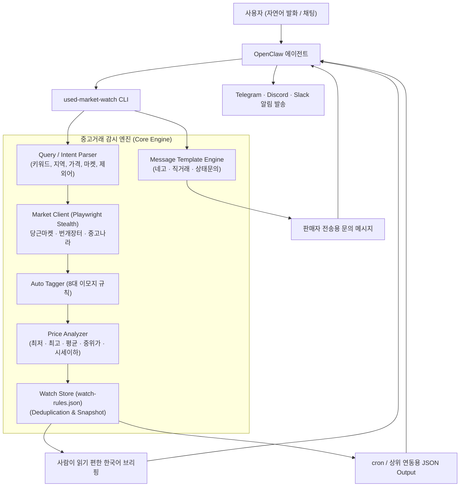

# 🥕 OpenClaw 중고거래 감시자 (Used Market Watch)

<p align="center">
  
  
  
  
  
</p>

<p align="center">
  <strong>당근마켓 🥕 · 번개장터 ⚡ · 중고나라 🛒</strong> 3대 한국 중고거래 플랫폼을 아우르는<br>
  <strong>자연어 검색 · 채팅형 시세 브리핑 · 8대 스마트 태깅 · 신규/가격하락 감시 · 판매자 문의 생성</strong> 올인원 OpenClaw 스킬입니다.
</p>

---

## 📑 목차

1. [✨ 핵심 특징 (Key Features)](#-핵심-특징-key-features)
2. [🏗️ 시스템 아키텍처 & 흐름도](#️-시스템-아키텍처--흐름도)
3. [🚀 빠른 시작 가이드 (Quick Start)](#-빠른-시작-가이드-quick-start)
   - [필수 요구사항 & 설치](#필수-요구사항--설치)
   - [1분 맛보기](#1분-맛보기)
4. [💡 주요 기능별 상세 사용법](#-주요-기능별-상세-사용법)
   - [1. 🔍 자연어 원샷 검색 & 시세 브리핑](#1--자연어-원샷-검색--시세-브리핑)
   - [2. 🏷️ 8대 이모지 자동 태깅 & 시세이하 급매 감지](#2-️-8대-이모지-자동-태깅--시세이하-급매-감지)
   - [3. 💬 판매자 문의 메시지 생성기 (Message Template)](#3--판매자-문의-메시지-생성기-message-template)
   - [4. 🎯 자연어 감시 규칙 등록 & 갱신 (Watch Rule)](#4--자연어-감시-규칙-등록--갱신-watch-rule)
   - [5. ⏰ 자동화 연동 플랜 (Integration Plan & cron)](#5--자동화-연동-플랜-integration-plan--cron)
   - [6. 🚨 감시 점검 & 가격 하락 알림 (Watch Check)](#6--감시-점검--가격-하락-알림-watch-check)
   - [7. 🛡️ 판매자 차단 & 방해금지 시간대 (Quiet Hours)](#7-️-판매자-차단--방해금지-시간대-quiet-hours)
5. [💻 CLI 명령어 종합 레퍼런스](#-cli-명령어-종합-레퍼런스)
6. [🤖 OpenClaw 대화형 운영 시나리오](#-openclaw-대화형-운영-시나리오)
7. [📁 데이터 저장 구조 (Data Schema)](#-데이터-저장-구조-data-schema)
8. [🛠️ 테스트 및 검증](#️-테스트-및-검증)
9. [⚠️ 주의사항 & 라이선스](#️-주의사항--라이선스)

---

## ✨ 핵심 특징 (Key Features)

- **3대 중고 플랫폼 동시 수집**: 당근마켓, 번개장터, 중고나라 매물을 단일 질의로 병렬 탐색
- **자연어 쿼리 완전 해석**: `"잠실에서 아이폰 15 프로 120만원 이하 번장만 -깨짐"`처럼 지역, 가격 범위, 마켓 한정, 제외어, 수량 한도를 한 문장에서 추출
- **스마트 시세 분석 & 급매 감지**: 마켓별 통계 외에도 전체 **최저가, 최고가, 평균가(Avg), 중위가(Median)**를 즉시 계산하며, 평균가 대비 25% 이상 저렴한 매물에 `🔥 시세이하` 뱃지 자동 부착
- **8대 이모지 자동 태깅 (`auto_tagger`)**:
  - `✨ A급`, `📦 풀박스`, `🔥 급처`, `💬 네고가능`, `📮 택포`, `🤝 직거래`, `✅ 정품`, `🎁 구성품포함`
- **판매자 문의 메시지 생성기 (`message-template`)**: 가격 네고, 직거래 희망, 상품 상태/구성품 확인 등 챗봇 대화 중 판매자에게 바로 복사해 보낼 수 있는 맞춤형 텍스트 생성
- **정밀한 가격 하락 감지 & 인하폭 표기**: 이전 등록 가격 대비 인하액과 할인율(%)을 계산하여 직관적인 브리핑 제공 (`100만원 → 85만원 (▼150,000원, -15.0%)`)
- **OpenClaw 친화적 아키텍처**:
  - GUI/DB 의존성을 없애고 경량 JSON 파일(`data/watch-rules.json`)로 상태 유지
  - cron 및 백그라운드 heartbeat에 최적화된 `--alerts-only --json` 출력 모드 지원
- **스텔스 스크래핑 엔진**: 한국어 로케일(`ko-KR`), 표준 User-Agent, 서울 타임존 및 `navigator.webdriver` 우회 스크립트가 적용된 고속 비동기 Playwright 세션 운용

---

## 🏗️ 시스템 아키텍처 & 흐름도



---

## 🚀 빠른 시작 가이드 (Quick Start)

### 필수 요구사항 & 설치

- **Python**: 3.10 이상
- **Playwright Chromium**: 브라우저 런타임 필요

```bash
# 1. 패키지 설치
pip install playwright pytest

# 2. Playwright Chromium 브라우저 설치 (필수)
python -m playwright install chromium
```

### 1분 맛보기

```bash
# 매물 검색 및 시세 브리핑
python scripts/used_market_watch.py search "잠실 아이폰 15 프로 120만원 이하"

# 판매자 네고 문의 메시지 생성
python scripts/used_market_watch.py message-template nego --title "아이폰 15 프로 128G" --price "110만원"

# 1시간 주기 신규 감시 규칙 저장
python scripts/used_market_watch.py watch-upsert "아이폰 15 프로 1시간마다 신규만 감시해줘"

# 감시 점검 실행 (신규 매물 및 가격하락 체크)
python scripts/used_market_watch.py watch-check --alerts-only
```

---

## 💡 주요 기능별 상세 사용법

### 1. 🔍 자연어 원샷 검색 & 시세 브리핑

복잡한 옵션 지정 없이 한국어 문장 그대로 입력하면 검색 조건이 자동 분류됩니다.

```bash
# 기본 자연어 검색
python scripts/used_market_watch.py search "잠실에서 아이폰 15 프로 120만원 이하 당근 번장만 -깨짐"

# 중고나라 포함 검색 및 JSON 결과 출력
python scripts/used_market_watch.py search "맥북 에어 m2 중고나라 포함" --json
```

**브리핑 출력 예시**:
```text
중고 매물 브리핑: 아이폰 15 프로
- 마켓=당근마켓, 번개장터 / 지역=잠실 / 최대=1,200,000원 / 제외=깨짐
- 총 18건, 표시 12건
- 전체 시세: 최저 950,000원, 평균 1,120,000원, 중위 1,100,000원, 최고 1,200,000원
- 당근마켓: 10건, 최저 950,000원, 최고 1,200,000원
- 번개장터: 8건, 최저 980,000원, 최고 1,190,000원
1. [당근마켓] 아이폰 15 프로 128G 블루 - 950,000원 (🔥 시세이하 / 잠실동 / 판매자 민트초코 / 태그 ✨ A급, 📦 풀박스)
   - https://www.daangn.com/articles/...
2. [번개장터] 아이폰 15 Pro 화이트 256 - 1,100,000원 (잠실역 / 판매자 애플러버 / 태그 💬 네고가능, 🤝 직거래)
   - https://m.bunjang.co.kr/products/...
```

---

### 2. 🏷️ 8대 이모지 자동 태깅 & 시세이하 급매 감지

매물 제목과 본문 메타데이터를 정밀 분석하여 구매 판단에 핵심적인 속성을 자동으로 분류합니다.

| 태그 | 이모지 | 매칭 키워드 예시 | 의미 |
| :--- | :---: | :--- | :--- |
| **A급** | ✨ | `A급`, `에이급`, `상태좋음`, `매우깨끗`, `최상`, `S급`, `민트급` | 상품 외관 상태 최상 |
| **풀박스** | 📦 | `풀박스`, `풀박`, `미개봉`, `새제품`, `미사용`, `원박스` | 패키지 및 기본 구성품 완비 |
| **급처** | 🔥 | `급처`, `급매`, `급급`, `빨리`, `오늘만`, `처분` | 시세 대비 빠른 정리를 원하는 매물 |
| **네고가능** | 💬 | `네고가능`, `네고`, `협의가능`, `가격협의`, `흥정`, `절충가능` | 가격 협의 가능 여부 |
| **택포** | 📮 | `택포`, `택배포함`, `배송비포함`, `무배`, `택배비포함` | 배송비 무료/포함 |
| **직거래** | 🤝 | `직거래`, `직거래만`, `직거래전용`, `직거래희망`, `대면거래` | 대면 안전 거래 가능 |
| **정품** | ✅ | `정품`, `정품확인`, `구매영수증`, `보증서`, `국내정품` | 정품 인증 및 영수증 증빙 |
| **구성품포함**| 🎁 | `구성품`, `풀구성`, `박스포함`, `악세사리포함`, `충전기포함` | 추가 악세서리 동봉 |

> **🔥 시세이하(Bargain) 감지**: 수집된 매물의 평균 시세(Average Price)를 기준으로 **25% 이상 저렴한 매물**은 `🔥 시세이하` 뱃지를 자동으로 부여하여 파격적인 급매물을 놓치지 않도록 돕습니다.

---

### 3. 💬 판매자 문의 메시지 생성기 (Message Template)

관심 있는 매물을 발견했을 때, 에이전트가 상황에 맞는 정중하고 자연스러운 한국어 문의 메시지를 즉시 작성해 줍니다.

```bash
# 1. 가격 네고 문의 메시지 생성
python scripts/used_market_watch.py message-template nego --title "맥북 에어 M2 16G" --price "115만원"

# 2. 직거래 문의 메시지 생성
python scripts/used_market_watch.py message-template direct --title "아이패드 프로 11" --location "강남역"

# 3. 지원되는 전체 템플릿 목록 확인
python scripts/used_market_watch.py message-template --list
```

**템플릿 종류**:
- `default`: 기본 판매 여부 확인 문의
- `nego`: 정중한 가격 조율 및 쿨거래 제안 문의
- `direct`: 희망 장소/일정 조율 직거래 문의
- `condition`: 기기 상태, 찍힘, 배터리 효율 확인 문의
- `package`: 본품 박스 및 충전기 풀구성 확인 문의
- `danggeun`: 당근마켓 이웃 친화적 인사말
- `bunjang`: 번개페이 및 즉시 안전결제 문의

**생성 예시**:
```text
판매자 문의 메시지 생성: [가격 네고 문의]
- 대상: 맥북 에어 M2 16G / 115만원
- 지역: 지역
- 판매자: 판매자

--- [메시지 내용 (복사하여 바로 사용하세요)] ---
안녕하세요! 맥북 에어 M2 16G 보고 연락드립니다.
현재 115만원에 판매중이신데, 혹시 조금 네고 가능할까요? 빠른 쿨거래 약속드립니다!
--------------------------------------------------
```

---

### 4. 🎯 자연어 감시 규칙 등록 & 갱신 (Watch Rule)

한 줄의 자연어 명령으로 감시 대상, 주기, 알림 조건을 완벽하게 파악하여 저장합니다.

```bash
# 신규 매물만 1시간마다 감시
python scripts/used_market_watch.py watch-upsert "아이폰 15 프로 1시간마다 신규만 감시해줘"

# 가격 하락만 감시
python scripts/used_market_watch.py watch-upsert "맥북 에어 가격 내려가면 알려줘"

# 매일 아침 정기 브리핑
python scripts/used_market_watch.py watch-upsert "플스5 매일 아침 8시에 브리핑해줘"

# 규칙 이름을 직접 지정하여 등록/수정
python scripts/used_market_watch.py watch-upsert '"잠실 맥북" 맥북 에어 m2 잠실 가격하락만 감시'
```

**규칙 관리**:
```bash
# 등록된 감시 규칙 목록 조회
python scripts/used_market_watch.py watch-list

# 특정 규칙 일시 정지 / 활성화 / 삭제
python scripts/used_market_watch.py watch-disable "잠실 맥북"
python scripts/used_market_watch.py watch-enable "잠실 맥북"
python scripts/used_market_watch.py watch-remove "잠실 맥북"
```

---

### 5. ⏰ 자동화 연동 플랜 (Integration Plan & cron)

OpenClaw의 백그라운드 크론(cron) 또는 상위 이벤트 시스템과 연결할 수 있는 완벽한 실행 청사진을 한 번에 뽑아냅니다.

```bash
python scripts/used_market_watch.py integration-plan "아이폰 15 프로 신규 매물만 1시간마다 감시해줘" --json
```

**JSON 출력 포함 항목**:
- `user_confirmation`: 사용자에게 대화형으로 보여줄 자연스러운 확인 문구
- `persist.command`: 감시 규칙 저장 CLI 명령어
- `execution.recommended_command`: 주기 점검 시 실행할 정확한 명령어
- `execution.cron_payload.expr`: 표준 5자리 cron 표현식 (예: `0 * * * *`)
- `execution.system_event`: 상위 시스템 라우팅 힌트

---

### 6. 🚨 감시 점검 & 가격 하락 알림 (Watch Check)

크론 또는 스케줄러가 백그라운드에서 주기적으로 호출하여 신규 매물과 가격 변동을 감지합니다.

```bash
# 신규 매물 및 가격 하락 발생 건만 조회 (알림용)
python scripts/used_market_watch.py watch-check --alerts-only

# 상위 봇 전송용 JSON 출력
python scripts/used_market_watch.py watch-check --alerts-only --json

# 최근 발생한 알림 이벤트 이력 조회
python scripts/used_market_watch.py watch-events --limit 10
```

> **가격 하락 알림 표기**:  
> `[당근마켓] 맥북 에어 M2 256G / 850,000원 (가격하락, 이전 1,000,000원 → 850,000원 (▼150,000원, -15.0%))`  
> 처럼 변동액과 인하율이 한눈에 파악됩니다.

---

### 7. 🛡️ 판매자 차단 & 방해금지 시간대 (Quiet Hours)

허위 매물 등록자나 업자를 원천 차단하고 야간 알림을 제어할 수 있습니다.

```bash
# 특정 판매자 차단 추가 및 해제
python scripts/used_market_watch.py block-seller-add "업자매장001"
python scripts/used_market_watch.py block-seller-remove "업자매장001"

# 야간 방해금지 시간 설정 (오전 8시부터 밤 11시까지만 알림 수신)
python scripts/used_market_watch.py quiet-hours-set 8 23

# 현재 설정 조회
python scripts/used_market_watch.py config-show --json
```

---

## 💻 CLI 명령어 종합 레퍼런스

| 명령어 | 주요 옵션 | 설명 |
| :--- | :--- | :--- |
| **`search <query>`** | `--limit`, `--json` | 3대 마켓 동시 검색 및 전체 시세(평균/중위) 브리핑 |
| **`parse <query>`** | `--limit` | 한국어 자연어 쿼리 해석 결과(키워드/지역/가격/제외어) 확인 |
| **`message-template [id]`** | `--title`, `--price`, `--location`, `--seller`, `--list`, `--json` | 판매자 문의 메시지 생성 (네고, 직거래, 상태 확인 등) |
| **`watch-plan <req>`** | `--limit`, `--json` | 자연어 감시 요청 해석 결과 및 주기/cron 예시 사전 검토 |
| **`watch-upsert <req>`** | `--limit`, `--json` | 자연어 감시 규칙 저장 (기존 규칙 존재 시 자동 갱신) |
| **`integration-plan <req>`** | `--persist`, `--json` | OpenClaw cron 및 systemEvent 연결용 연동 번들 생성 |
| **`watch-list`** | `--json` | 저장된 모든 감시 규칙 목록 및 활성화 상태 조회 |
| **`watch-check [name]`** | `--alerts-only`, `--json` | 감시 규칙 점검 실행 (신규 매물 및 가격 하락 감지) |
| **`watch-events [name]`** | `--limit`, `--json` | 최근 감시 이벤트(신규/가격변동) 발생 이력 조회 |
| **`watch-enable <name>`** | `--json` | 비활성화된 감시 규칙 재활성화 |
| **`watch-disable <name>`** | `--json` | 감시 규칙 일시 정지 |
| **`watch-remove <name>`** | `--json` | 감시 규칙 영구 삭제 |
| **`block-seller-add <id>`** | `--json` | 업자/비매너 판매자 영구 차단 목록 추가 |
| **`block-seller-remove <id>`** | `--json` | 차단된 판매자 차단 해제 |
| **`quiet-hours-set <start> <end>`** | `--disable`, `--json` | 야간 알림 방해금지 시간대 설정 |
| **`config-show`** | `--json` | 전역 운영 설정(차단 판매자, 방해금지 시간 등) 확인 |

---

## 🤖 OpenClaw 대화형 운영 시나리오

OpenClaw 챗봇 세션에서 자연스럽게 활용할 수 있는 대표 대화 패턴입니다.

### 시나리오 1. 빠른 시세 브리핑 및 네고 문의 작성
> **사용자**: "잠실에서 맥북 에어 M2 100만원 이하로 찾아줘"  
> **OpenClaw**: *(search 실행 후 브리핑 전달)*  
> "잠실 인근 당근마켓/번개장터에서 총 6건이 발견되었습니다. 평균 시세는 98만원이며, 85만원인 `🔥 시세이하` 풀박스 매물이 있습니다!"  
> **사용자**: "그 매물 판매자한테 네고 문의글 좀 써줘"  
> **OpenClaw**: *(message-template nego 실행 후 출력)*  
> "판매자분께 복사해서 바로 보내실 수 있는 메시지입니다:  
> `안녕하세요! 맥북 에어 M2 보고 연락드립니다. 현재 85만원에 올려주셨는데, 혹시 조금 네고 가능할까요? 빠른 쿨거래 약속드립니다!`"

### 시나리오 2. 신규 매물 감시 및 cron 자동 등록
> **사용자**: "아이폰 15 프로 1시간마다 신규 매물만 감시해줘"  
> **OpenClaw**: *(integration-plan 실행)*  
> "'아이폰 15 프로' 신규 매물을 1시간마다 확인하도록 규칙을 등록할까요? (cron: `0 * * * *`)"  
> **사용자**: "응 등록해줘"  
> **OpenClaw**: *(watch-upsert 실행 및 cron 작업 연동 완료)*

---

## 📁 데이터 저장 구조 (Data Schema)

복잡한 데이터베이스 설정 없이 `data/` 디렉토리의 표준 JSON 파일로 모든 상태를 관리합니다.

- **`data/watch-rules.json`**:
  - `rules`: 등록된 감시 규칙 본문 (이름, 쿼리, 주기, 필터, 스케줄 메타)
  - `last_seen`: 매물 중복 판정용 스냅샷 (`article_key`별 마지막 가격 및 시간)
  - `events`: 이미 발송된 신규/가격하락 이벤트 deduplication 이력
- **`data/watch-config.json`**:
  - `blocked_sellers`: 전역 차단 판매자 닉네임 리스트
  - `notification_window`: 야간 방해금지 시간대 설정 (`start_hour`, `end_hour`)

---

## 🛠️ 테스트 및 검증

프로젝트의 모든 핵심 모듈과 회귀 방지를 위한 42개 단위 테스트가 작성되어 있습니다.

```bash
# 전체 테스트 실행
python -m pytest tests -q

# 실행 결과
....................................                                     [100%]
42 passed in 0.14s
```

- `tests/test_auto_tagger.py`: 8대 태그 자동 분류 및 이모지 검증
- `tests/test_message_templates.py`: 템플릿 변수 치환 및 마켓별 필터링 검증
- `tests/test_cli_and_features.py`: 평균/중위 시세 산출, 급매 감지, 가격 인하폭 포맷, CLI 핸들러 검증, Windows(cp949) 콘솔 이모지 출력 검증
- `tests/test_market_text.py`: 네이버 검색 접미사 제거, 제목 가격 추정(단위 가드), 번개장터 pid 추출, 마켓별 격리 수집 검증
- `tests/test_query_parser.py`: 한국어 자연어 문장 의도 파싱 검증
- `tests/test_watch_check_regressions.py`: 중복 알림 방지, baseline 초기화 및 quiet-hours 검증

---

## ⚠️ 주의사항 & 라이선스

- **스크래핑 정책**: 본 스킬은 공공 검색 결과를 기반으로 동작하며 각 플랫폼의 이용 약관 및 로봇 배제 정책을 준수해야 합니다.
- **플랫폼 DOM 변경**: 1차/폴백 셀렉터와 마켓별 격리 수집으로 대응하지만, 구조가 크게 바뀌면 셀렉터 업데이트가 필요할 수 있습니다.
- **라이선스**: MIT License
- **저장소**: [twbeatles/openclaw-used-market-watch](https://github.com/twbeatles/openclaw-used-market-watch)
